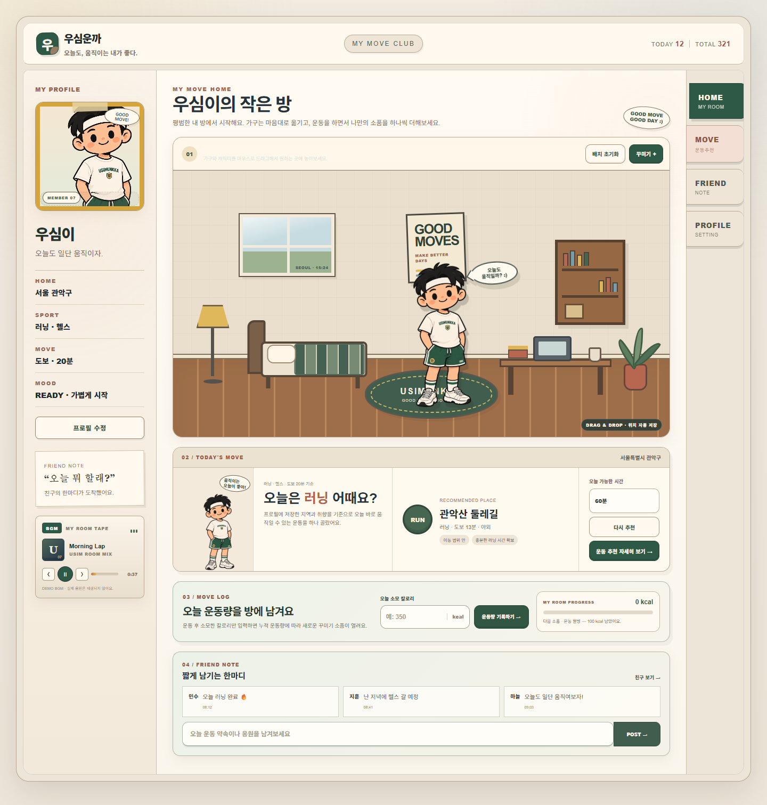
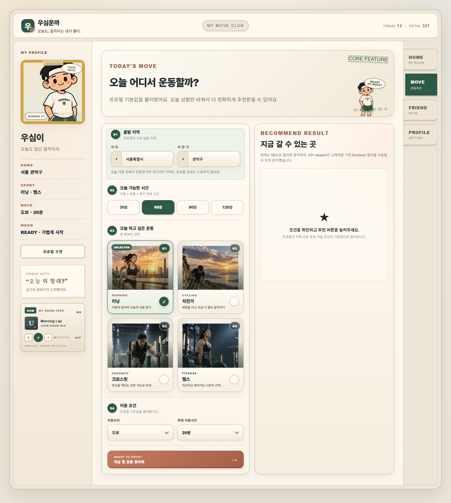
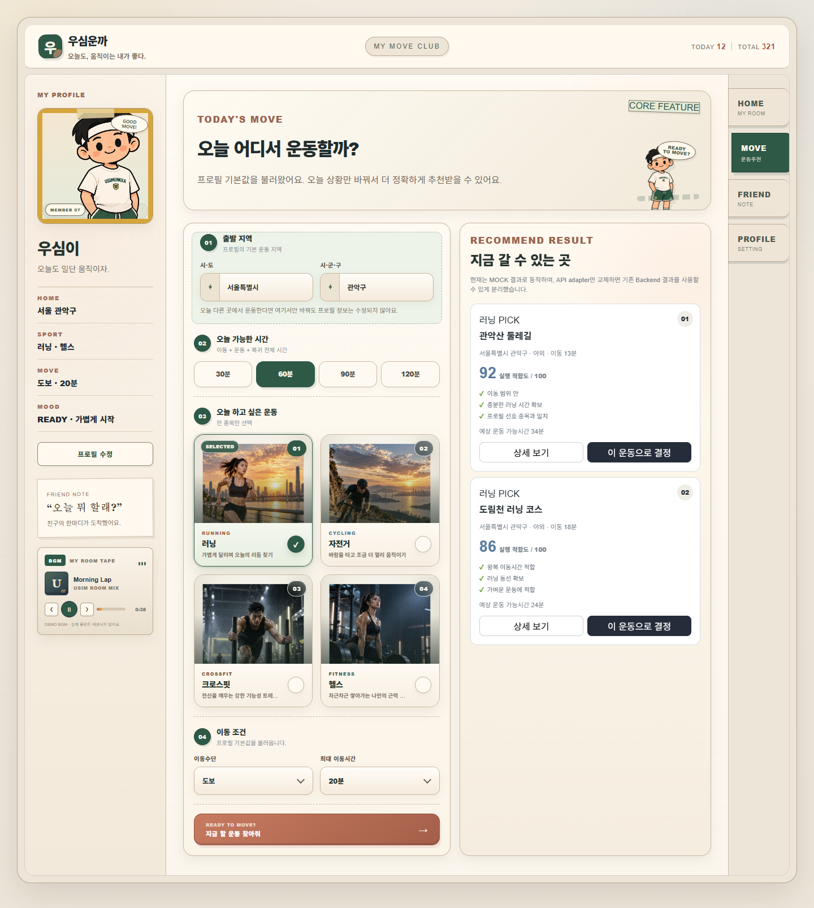
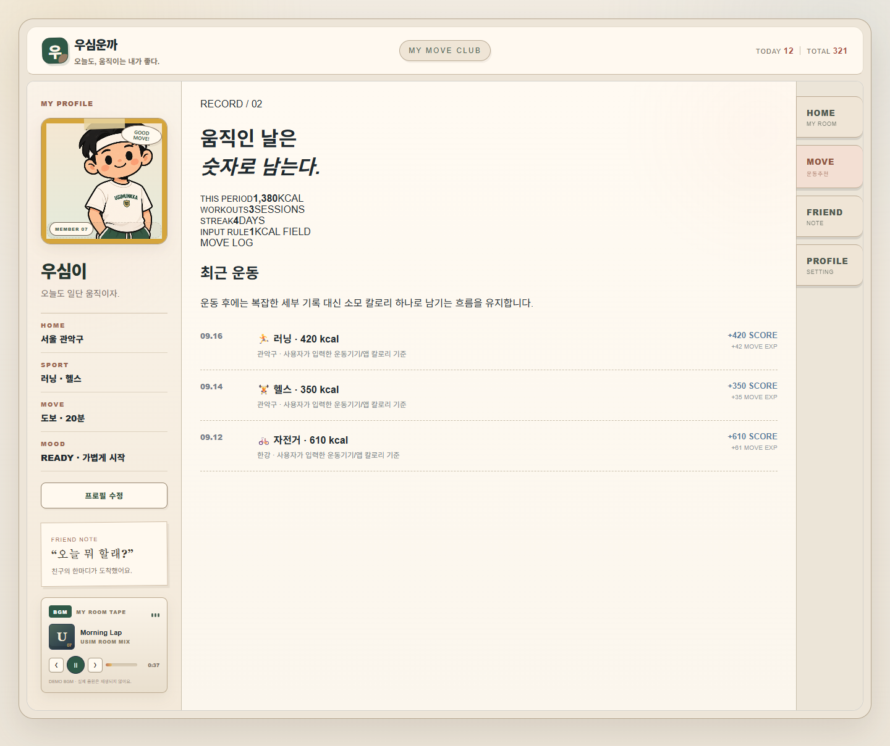
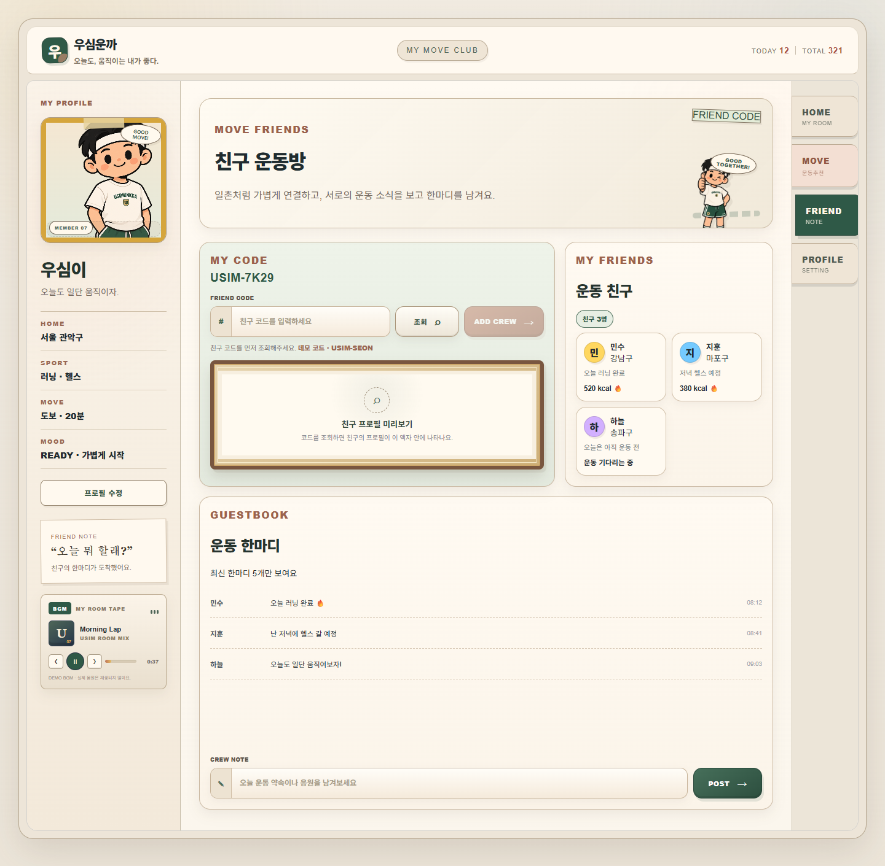
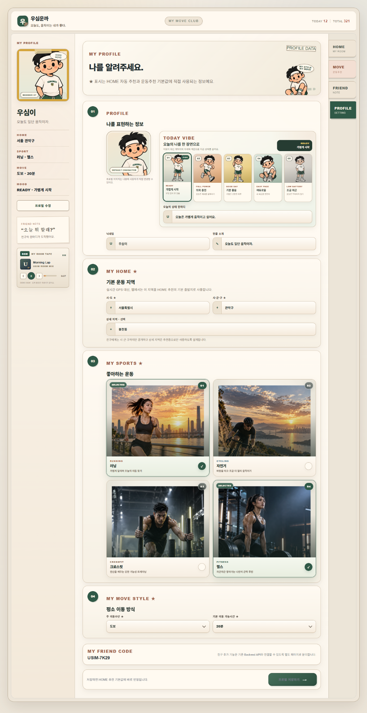
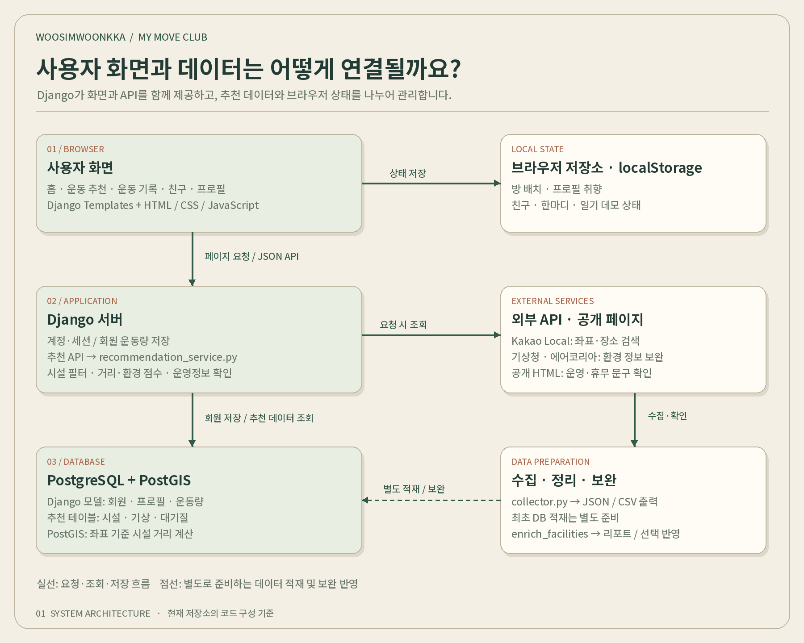
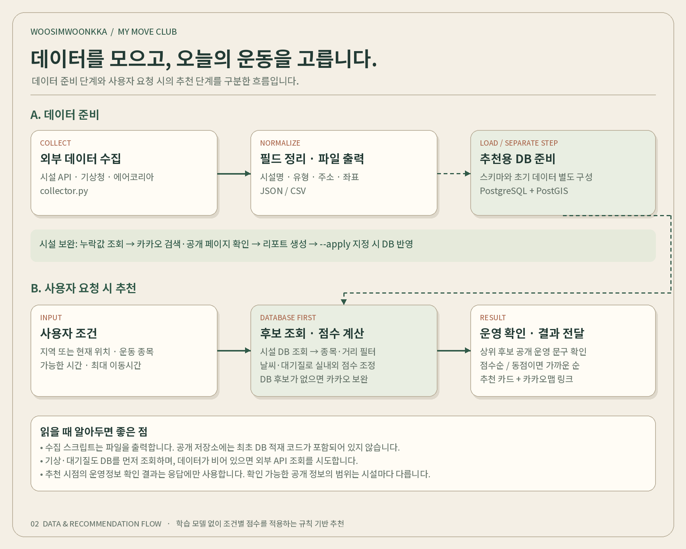

<div align="center">

# 우심운까 · WoosimWoonkka

### 오늘도, 움직이는 내가 좋다.

**오늘 어디서 운동할지 고민하는 순간부터, 운동을 마치고 나만의 방을 꾸미는 순간까지.**

지역·날씨·대기질·운동 취향을 연결하는 운동 장소 추천 웹 서비스

<table align="center">
  <tr>
    <td align="center"><a href="#프로젝트-소개">📌<br><b>프로젝트 소개</b></a></td>
    <td align="center"><a href="#기술-스택">🧩<br><b>기술 스택</b></a></td>
    <td align="center"><a href="#화면-둘러보기">🖥️<br><b>화면 둘러보기</b></a></td>
    <td align="center"><a href="#시스템-구조">🏗️<br><b>시스템 구조</b></a></td>
    <td align="center"><a href="#실행-방법">🚀<br><b>실행 방법</b></a></td>
    <td align="center"><a href="#팀-소개">👥<br><b>팀 소개</b></a></td>
  </tr>
</table>

</div>



## 프로젝트 소개

운동을 하기로 마음먹어도 막상 시작하려면 고민이 생깁니다. 지금 갈 수 있는 곳은 어디인지, 오늘 날씨에 야외 운동을 해도 괜찮을지, 가까운 시설이 운영 중인지 여러 정보를 찾아봐야 합니다.

**우심운까는 이 고민을 줄이고, 작은 움직임이 다음 운동으로 이어지도록 돕는 프로젝트입니다.** 지역과 선호 운동, 이동 가능한 범위를 바탕으로 운동 장소를 찾고, 날씨와 대기질 정보를 더해 추천 이유를 보여줍니다. 운동 후에는 소모 칼로리를 기록하고, 누적 운동량에 따라 나만의 방에 소품을 하나씩 더할 수 있습니다.

캐릭터와 미니홈피를 닮은 화면은 운동을 일상의 즐거운 활동으로 느끼게 하는 장치입니다. 장소를 고르는 기능과 기록·꾸미기·친구 화면을 하나의 경험으로 연결했습니다.

| 우리가 풀고 싶은 문제 | 우심운까의 접근 |
| --- | --- |
| 운동할 곳을 찾는 데 여러 검색이 필요해요. | 지역과 운동 종목을 입력하면 시설 후보를 한곳에서 확인합니다. |
| 가까운 곳이어도 오늘 운동하기 좋은지는 모르겠어요. | 거리뿐 아니라 기온·습도·강수·풍속·미세먼지를 추천에 반영합니다. |
| 추천 결과가 왜 나왔는지 알고 싶어요. | 시설별 추천 이유와 이동시간 추정치, 확인 가능한 운영정보를 함께 보여줍니다. |
| 운동을 꾸준히 이어가기 어려워요. | 간단한 운동량 기록과 소품 보상, 친구 한마디로 다시 방문할 이유를 만듭니다. |

> 현재 저장소는 실제 DB·외부 API를 이용하는 추천 기능과 브라우저 저장소 기반의 체험 기능이 함께 있는 팀 프로젝트입니다. 아래 화면은 데모 캡처이며, 표시된 시설·점수·운동 기록·친구 정보는 실행 환경의 실제 결과와 다를 수 있습니다.

## 기술 스택

<div align="center">

<h3>📚 Tech Stack 📚</h3>

<p><strong>🖥️ Frontend</strong></p>
<p>
  
  
  
</p>

<p><strong>⚙️ Backend</strong></p>
<p>
  
  
</p>

<p><strong>🗄️ Database</strong></p>
<p>
  
  
</p>

<p><strong>🤝 Collaboration</strong></p>
<p>
  
  
</p>

</div>

우심운까는 **Python·Django로 화면과 API를 함께 제공하고, PostgreSQL·PostGIS로 시설과 위치 데이터를 처리하는 웹 애플리케이션**입니다. 화면은 HTML·CSS·JavaScript로 구성하고, 데이터 수집과 추천 로직도 Python으로 구현했습니다.

| 구분 | 사용 기술 | 프로젝트에서 맡는 역할 |
| --- | --- | --- |
| **프론트엔드** | HTML, CSS, Vanilla JavaScript | 캐릭터 화면, 방 꾸미기, 프로필 입력, 추천 카드와 사용자 상호작용 |
| **화면 렌더링** | Django Templates | 서버 데이터를 HTML에 연결하고 공통 레이아웃과 페이지 구성 |
| **백엔드** | Python, Django | 회원가입·로그인, 세션 관리, 추천 API, 회원 운동량 저장 |
| **데이터베이스** | PostgreSQL | 회원·운동량과 추천용 시설·기상·대기질 데이터 관리 |
| **공간 데이터 처리** | PostGIS | 위도·경도 기준으로 시설까지의 거리 계산 |
| **DB 연결** | psycopg | Django와 PostgreSQL 연결 |
| **외부 데이터 수집** | requests | 시설·날씨·대기질 및 장소 검색 API 요청 |
| **운영정보 확인** | BeautifulSoup4, urllib.robotparser | robots.txt 확인과 공개 HTML의 운영·휴무 관련 문구 추출 |
| **좌표 변환** | pyproj | 수집 코드에서 대기질 측정소 조회에 사용하는 좌표 변환 |
| **환경 설정** | python-dotenv, 환경변수 | 수집 스크립트의 API 키·조회 설정 로드 |
| **브라우저 상태 저장** | localStorage | 방 배치, 프로필 취향, 친구·한마디·일기 데모 상태 저장 |
| **위치·지도 연동** | Browser Geolocation API, Kakao Local API, 카카오맵 링크 | 현재 위치 조회, 지역 좌표·시설 검색, 지도와 길찾기 연결 |
| **외부 데이터 소스** | 기상청 API, 에어코리아 API, 설정된 시설 API | 추천에 필요한 환경·시설 정보 수집 및 보완 |
| **협업 도구** | GitHub, Notion | 코드 및 변경 이력 관리, 프로젝트 문서 정리와 팀 정보 공유 |

### 주요 Python 라이브러리

아래는 [requirements.txt](requirements.txt)에 선언된 **설치 허용 버전 범위**입니다. 실제 개발 환경에 설치된 버전을 뜻하지는 않습니다.

| 라이브러리 | 선언된 범위 | 용도 |
| --- | --- | --- |
| Django | `>=5.2,<7` | 웹 프레임워크 |
| psycopg[binary] | `>=3.2,<4` | PostgreSQL 드라이버 |
| beautifulsoup4 | `>=4.12,<5` | 공개 페이지 HTML 파싱 |
| python-dotenv | `>=1.0,<2` | `.env` 설정 로드 |
| requests | `>=2.31,<3` | HTTP API 통신 |
| pyproj | `>=3.7,<4` | 좌표계 변환 |

### 기술이 연결되는 방식

- **화면과 서버** — Django 템플릿이 페이지를 만들고, JavaScript의 `fetch`가 추천 조회·운동량 저장 API를 호출합니다.
- **서버와 데이터** — 회원·운동량은 Django ORM으로 관리하고, 추천용 시설·환경 데이터는 SQL로 조회합니다. 시설 거리 계산에는 PostGIS 함수를 사용합니다.
- **수집과 추천** — Python으로 외부 데이터를 수집·정리하고, 지역·종목·거리·날씨·대기질 조건에 따라 추천 점수를 계산합니다.
- **화면 상태** — 방 배치와 체험용 친구·일기 정보는 `localStorage`에 보관하고, 로그인 회원의 누적 운동량은 서버 DB에 저장합니다.

현재 추천은 **규칙 기반 점수 계산**이며, 저장소에 별도의 학습 모델이나 학습 파이프라인은 포함되어 있지 않습니다. Python·PostgreSQL·PostGIS의 정확한 실행 버전은 저장소에 고정되어 있지 않아 임의로 표기하지 않았습니다.

## 주요 기능

### 1. 오늘의 운동 장소 추천

- 프로필의 기본 지역과 선호 운동을 활용해 추천을 시작합니다.
- 추천 화면에서는 오늘의 지역, 가능한 시간, 종목, 이동 조건을 바꿀 수 있습니다.
- 러닝·자전거·크로스핏·헬스를 중심으로 운동을 선택합니다.
- 현재 위치를 허용하면 좌표 기준으로 주변 시설을 조회합니다.
- 추천 카드에서 시설 주소, 거리·이동시간 추정치, 추천 이유를 확인하고 카카오맵으로 연결합니다.

### 2. 날씨와 대기질을 고려한 추천

- 기온·습도·강수·풍속과 PM10·PM2.5 정보를 활용합니다.
- 비가 오거나 미세먼지 수치가 높을 때 실내 시설을 우선하는 등 조건별 점수를 적용합니다.
- 시설·환경 데이터를 DB에서 먼저 조회하고, 필요한 경우 외부 API로 보완합니다.
- 추천 시점에 상위 후보의 공개 운영·휴무 문구를 확인합니다. 확인할 수 없는 정보는 확인이 필요한 상태로 남습니다.

### 3. 운동이 쌓이는 나만의 방

- 캐릭터와 가구를 드래그해 나만의 공간을 꾸밉니다.
- 운동 후 소모 칼로리를 입력하면 누적 운동량이 증가합니다.
- 운동량에 따라 물병·타월·덤벨·운동 가방·러닝화·메달이 순서대로 열립니다.
- 회원의 누적 운동량은 서버에 저장되고, 방의 배치와 꾸미기 상태는 브라우저에 저장됩니다.

| 누적 운동량 | 열리는 소품 |
| ---: | --- |
| 100 kcal | 운동 물병 |
| 250 kcal | 스포츠 타월 |
| 450 kcal | 덤벨 |
| 700 kcal | 운동 가방 |
| 1,000 kcal | 러닝화 |
| 1,500 kcal | 기념 메달 |

회원 레벨은 `누적 칼로리 ÷ 1,500의 정수 몫 + 1`로 계산합니다. 칼로리는 사용자가 직접 입력하며, 운동기기 자동 연동 기능은 포함되어 있지 않습니다.

### 4. 나를 표현하는 프로필과 운동 친구

프로필에서는 기본 운동 지역, 선호 종목, 이동 조건과 오늘의 기분을 설정합니다. 친구 화면에서는 코드 조회, 프로필 미리보기, 친구 추가와 운동 한마디를 체험할 수 있습니다. 현재 친구 조회는 데모 디렉터리를 사용하고, 친구 목록과 한마디는 브라우저에 저장됩니다.

## 화면 둘러보기

### HOME · 내 운동방

문서 상단의 메인 화면입니다. 방 꾸미기, 오늘의 운동 추천, 칼로리 기록, 친구 한마디를 한 공간에 모았습니다. 화면을 둘러보다 자연스럽게 다음 운동을 선택할 수 있도록 구성했습니다.

### MOVE · 오늘의 조건으로 운동 찾기

출발 지역, 가능한 시간, 원하는 종목과 이동 조건을 선택합니다. 매번 정보를 처음부터 입력하지 않도록 프로필의 기본값을 불러옵니다.



### RESULT · 추천 이유를 보고 선택하기

추천 장소와 점수, 이동시간, 추천 이유를 카드 형태로 비교합니다. 첨부 화면은 데모 결과이며, 현재 서버 추천은 DB와 환경 정보를 이용하는 별도 경로로 동작합니다.



<details>
<summary><strong>DIARY · 운동 기록 화면 펼쳐보기</strong></summary>

날짜별 운동 종목과 소모 칼로리를 확인하는 화면입니다. 현재 일기 목록은 브라우저의 데모 기록을 사용합니다. 홈에서 입력하는 회원의 누적 운동량 API와는 별도이며, 두 기록의 통합은 이후 개선할 항목입니다.



</details>

<details>
<summary><strong>FRIEND · 친구 운동방 펼쳐보기</strong></summary>

친구 코드를 조회해 프로필을 확인하고, 운동 친구를 추가하거나 한마디를 남기는 흐름입니다. 데모 코드 `USIM-SEON`으로 친구 추가를 체험할 수 있습니다.



</details>

<details>
<summary><strong>PROFILE · 내 프로필 펼쳐보기</strong></summary>

닉네임과 한 줄 소개, 캐릭터의 기분, 기본 운동 지역, 선호 종목과 이동 방식을 설정합니다. 화면에서 저장한 취향·꾸미기 정보는 브라우저 저장소를 이용합니다.



</details>

## 시스템 구조



우심운까는 **Django가 화면과 API를 함께 제공하는 구조**입니다. 별도의 프론트엔드 서버 없이 Django 템플릿으로 페이지를 렌더링하고, JavaScript가 추천 조회·운동량 저장·방 꾸미기 등의 상호작용을 처리합니다.

| 구성 요소 | 하는 일 | 주요 코드 |
| --- | --- | --- |
| 사용자 화면 | 홈·추천·기록·친구·프로필 화면 및 상호작용 | `frontend/templates/`, `frontend/static/assets/` |
| 계정·세션 | 회원가입, 비밀번호 해시 검증, 회원·게스트 접근 처리 | `frontend/auth_forms.py`, `frontend/auth_views.py` |
| 추천 API | 지역·종목·시간·좌표 입력을 받아 추천 결과를 JSON으로 응답 | `frontend/live_recommendations.py` |
| 추천 서비스 | 시설 조회, 거리 계산, 환경 점수와 운영정보 반영 | `frontend/recommendation_service.py` |
| 데이터 수집 | 시설·날씨·대기질 API 조회, 정규화, JSON·CSV 출력 | `frontend/collector.py` |
| 시설 데이터 보완 | 누락 필드 조회, 외부 검색, 운영 문구 확인, 리포트 생성 | `frontend/management/commands/enrich_facilities.py` |
| PostgreSQL·PostGIS | 회원·운동량 저장, 추천용 시설·환경 데이터 조회와 공간 거리 계산 | `config/settings.py`, `frontend/models.py`, 추천 서비스의 SQL |
| 브라우저 저장소 | 프로필 취향, 방 배치, 친구·한마디·일기 데모 상태 유지 | `frontend/static/assets/js/api.js`, `home.js` |

### 데이터 수집에서 추천까지



1. **수집** — 시설 정보와 기상청·에어코리아 데이터를 API로 가져옵니다.
2. **정리** — 시설 이름·유형·주소·좌표 등의 필드를 통일하고 JSON·CSV로 출력합니다.
3. **DB 준비** — 팀에서 준비한 시설·환경 테이블과 데이터를 PostgreSQL에 구성합니다. 공개된 `collector.py`는 파일 출력까지 수행하며, 최초 DB 적재 작업은 별도로 필요합니다.
4. **시설 보완** — 누락 항목을 조회하고 카카오 장소 검색·공개 페이지 확인 결과를 리포트로 남깁니다. `--apply` 옵션을 지정하면 보완 값과 확인 이력을 DB에 반영합니다.
5. **추천** — 사용자 조건과 시설·환경 데이터를 결합해 후보를 계산합니다.
6. **운영정보 확인** — 상위 후보의 공개 운영·휴무 문구를 다시 확인하고, 결과를 추천 카드에 전달합니다. 이 시점의 확인 결과는 DB에 저장하지 않습니다.

### 추천 방식

현재 추천 엔진은 **조건별 가중치를 적용하는 규칙 기반 방식**입니다.

| 단계 | 처리 내용 |
| --- | --- |
| 기준 위치 결정 | 현재 위치 좌표를 사용하거나 카카오 지역 검색으로 지역 중심 좌표를 구합니다. |
| 시설 후보 조회 | `facility_processed`에서 시설을 조회하고 PostGIS로 거리를 계산합니다. |
| 조건 필터 | 시설명·유형으로 종목을 분류하고 선택 종목과 최대 이동시간을 반영합니다. |
| 점수 계산 | 거리 점수에 기온·습도·강수·풍속·대기질에 따른 가감점을 적용합니다. |
| 후보 보완 | 조건에 맞는 DB 후보가 없으면 카카오 장소 검색 결과로 보완합니다. |
| 운영 확인·정렬 | 최대 20개 후보 중 상위 10개의 공개 운영정보를 확인하고, 점수순·동점 시 거리순으로 정렬합니다. |

이동시간은 거리 기반 도보 추정치(`거리 km × 20분`)입니다. 화면의 이동수단 선택이 실제 대중교통 경로 계산으로 연결되지는 않습니다. 외부 장소 검색으로 보완된 결과는 별도 거리 중심 점수를 사용하며, 최대 이동시간을 넘는 후보가 포함될 수 있습니다.

기상 조회 격자는 현재 `KMA_NX`, `KMA_NY` 설정을 사용합니다. 사용자 위치마다 기상 격자를 자동 변환하는 구조는 아직 아닙니다. 추천 점수는 후보 비교를 위한 값이며, 운동 효과나 시설 운영 여부를 보장하는 수치는 아닙니다.

## 프로젝트 구성

저장소 루트에 Django 애플리케이션이 들어 있습니다.

| 경로 | 설명 |
| --- | --- |
| `README.md` | 프로젝트 소개와 실행 안내 |
| `docs/images/` | 이 README에 사용하는 화면 캡처와 구조도 |
| `manage.py` | Django 관리 명령 실행 진입점 |
| `config/` | 프로젝트 설정과 최상위 URL 연결 |
| `frontend/models.py` | Profile, Member, WorkoutProgress 모델 |
| `frontend/auth_views.py` | 계정·세션·회원 운동량 및 주요 페이지 |
| `frontend/urls.py` | 페이지와 API 주소 |
| `frontend/recommendation_service.py` | DB 우선 추천 엔진 |
| `frontend/collector.py` | 외부 데이터 수집·정규화 |
| `frontend/management/commands/` | 시설 정보 보완 관리 명령 |
| `frontend/migrations/` | Django 모델의 DB 변경 이력 |
| `frontend/templates/` | 서비스·인증 화면 템플릿 |
| `frontend/static/assets/` | CSS, JavaScript, 캐릭터·종목 이미지 |
| `CRAWLING_AND_RECOMMENDATION.md` | 시설 보완과 추천 코드 상세 설명 |

`frontend`라는 앱 이름 안에 화면 코드와 백엔드 로직이 함께 들어 있습니다.

## 실행 방법

### 1. 프로젝트와 가상환경 준비

```bash
git clone https://github.com/2nd-MLOps-engineer/woosimwoonkka-web.git
cd woosimwoonkka-web
python3 -m venv .venv
```

macOS / Linux:

```bash
source .venv/bin/activate
```

Windows PowerShell:

```powershell
.venv\Scripts\Activate.ps1
```

```bash
python -m pip install -r requirements.txt
```

Python 버전은 설치할 Django·의존성의 지원 범위에 맞춰 준비합니다. 저장소에는 Python 버전을 고정하는 파일이 없습니다.

### 2. PostgreSQL과 추천 데이터 준비

`config/settings.py`의 `DATABASES`를 팀의 DB 접속정보에 맞춥니다. 현재 설정은 로컬 PostgreSQL을 사용하며, DB 접속정보를 `.env`에서 자동으로 읽도록 구성되어 있지는 않습니다.

추천 기능에는 PostGIS와 아래 테이블의 스키마·데이터가 필요합니다.

| 테이블 | 용도 |
| --- | --- |
| `facility_processed` | 시설명·유형·주소·위도·경도 및 보완 이력 |
| `weather_ultra_ncst` | 격자별 기상 관측값과 수집 시각 |
| `air_quality_processed` | 측정소별 대기질과 수집 시각 |

**`python manage.py migrate`는 회원·운동량 등 Django 관리 테이블을 생성합니다. 위 추천용 테이블의 초기 스키마·데이터는 생성하지 않으므로 팀의 데이터 담당자가 준비한 자료로 별도 구성해야 합니다.** 대용량 CSV와 초기 적재 스크립트는 확인한 공개 저장소에 포함되어 있지 않습니다.

### 3. API 환경변수 설정

`manage.py`와 같은 위치에 `.env`를 직접 만듭니다. 저장소의 `.env.example`을 복사해 사용할 수 있습니다.

```dotenv
KAKAO_REST_API_KEY=발급받은_카카오_REST_API_키
KMA_SERVICE_KEY=발급받은_기상청_서비스키
AIRKOREA_SERVICE_KEY=발급받은_에어코리아_서비스키

# 기상 관측 격자 — 실행 대상 지역에 맞게 설정
KMA_NX=60
KMA_NY=127

# 시설 수집 스크립트를 사용할 때 설정
FACILITY_API_URL=사용할_시설_API_주소
FACILITY_SERVICE_KEY=발급받은_시설_API_서비스키
AIRKOREA_STATION=사용할_측정소명
```

지역 좌표·장소 검색에는 카카오 키를 사용합니다. 기상·대기질 키는 수집 및 DB 조회 결과가 비어 있을 때의 외부 조회에 사용됩니다. 시설 API 주소는 팀이 사용하는 데이터 제공처에 맞춰 설정합니다. 실제 키를 넣은 `.env`는 커밋하지 않습니다.

### 4. 마이그레이션 및 서버 실행

```bash
python manage.py migrate
python manage.py runserver
```

브라우저에서 [로컬 시작 화면](http://127.0.0.1:8000/)을 열어 회원가입·로그인 또는 게스트 체험으로 시작합니다. 회원 운동량은 로그인 후 저장할 수 있습니다. 게스트 체험도 Django 세션용 DB 연결은 필요합니다.

### 5. 수집·보완 명령

아래 명령은 모두 저장소 루트에서 실행합니다.

```bash
# 시설·날씨·대기질 수집 및 JSON·CSV 출력
python frontend/collector.py --region "서울특별시 관악구" --limit 50

# 시설 누락값 조사: DB를 변경하지 않고 리포트 생성
python manage.py enrich_facilities --limit 100

# 리포트를 검토한 뒤 보완 값을 DB에 반영할 때
python manage.py enrich_facilities --limit 100 --apply
```

`collector.py`를 단독 실행할 때는 환경변수를 셸에 미리 설정하거나 수집 코드가 읽는 환경 파일을 준비해야 합니다. 수집 결과는 실행 위치의 출력 폴더에, 시설 보완 리포트는 `output/facility_enrichment/`에 생성됩니다. 자세한 동작은 [시설 데이터 보완과 운동 추천 문서](CRAWLING_AND_RECOMMENDATION.md)를 참고하세요.

## 주요 페이지와 API

| 구분 | 경로 | 역할 |
| --- | --- | --- |
| 시작 | `/` | 서비스 소개 및 진입 |
| 계정 | `/signup/`, `/login/` | 회원가입·로그인 |
| 홈 | `/main/` | 운동방, 추천, 누적 운동량 |
| 추천 | `/recommend/` | 조건 입력과 추천 결과 |
| 운동 기록 | `/diary/` | 운동 기록 데모 화면 |
| 친구 | `/friends/` | 친구 코드·프로필·한마디 |
| 프로필 | `/profile/` | 기본 지역과 취향 설정 |
| 추천 API · GET | `/api/live-recommendations/` | 시설·환경 기반 추천 JSON |
| 계정 상태 · GET | `/api/account-state/` | 친구 코드·레벨·누적 운동량 |
| 운동량 저장 · POST | `/api/workout-calories/` | 회원의 칼로리 기록 저장 |

프론트엔드에서는 같은 뷰에 연결된 `/nearby-facilities-data/`, `/account-state-data/`, `/workout-calories-data/` 별칭 경로도 사용합니다.

## 현재 구현 범위와 다음 단계

| 영역 | 현재 구현 | 다음 개선 방향 |
| --- | --- | --- |
| 계정·운동량 | DB 저장, 세션 로그인, 비밀번호 해시, 회원별 누적 칼로리·레벨 | 기록 관리와 입력 검증 보강 |
| 추천 | DB 우선 조회, PostGIS 거리 계산, 환경 가중치, 외부 장소 보완 | 종목 분류·환경 결측값 처리·추천 기준 고도화 |
| 시간·위치 | 거리 기반 이동시간 추정, 설정된 기상 격자 사용 | 실제 이동수단별 경로와 위치별 기상 격자 연동 |
| 데이터 파이프라인 | API 수집·파일 출력, 시설 보완 명령 | 초기 적재 절차 문서화와 주기적 수집 자동화 |
| 방·프로필 취향 | 브라우저 저장소에 상태 저장 | 회원 계정별 서버 저장 및 여러 기기 간 동기화 |
| 친구·한마디 | 데모 친구 코드와 브라우저 저장소 | 실제 회원 조회, 친구 관계·방명록 API 연결 |
| 운동 일기 | 데모 기록 목록 | 회원 운동량 기록과 일기 화면 통합 |

배포 환경에서는 개발용 `DEBUG`, `SECRET_KEY`, `ALLOWED_HOSTS`와 DB 접속 설정을 별도로 관리해야 합니다. 이 README의 구조도는 현재 코드 구성을 설명하며, 운영 배포 인프라를 나타내지는 않습니다.

## 팀 소개

**4명이 화면, 데이터, 백엔드를 나누어 맡고 하나의 서비스로 연결했습니다.**

| 팀원 | 담당 영역 | 맡은 역할 |
| --- | --- | --- |
| **신경호** | 프론트엔드 · 발표자료 | 서비스 화면 구현과 사용자 인터페이스 구성, 프로젝트 발표자료 준비 |
| **류지예** | 프론트엔드 · 발표자료 | 서비스 화면 구현과 사용자 경험 구성, 프로젝트 발표자료 준비 |
| **백선영** | 데이터 수집 · 데이터베이스 파이프라인 | 데이터베이스 구축을 위한 데이터 수집과 데이터 파이프라인 구축 |
| **김형준** | 백엔드 · 프로젝트 전반 | 백엔드 개발을 중심으로 기능 연동과 그 외 프로젝트 전반의 작업 담당 |

프론트엔드는 사용자가 만나게 될 화면과 흐름을, 데이터 파트는 추천의 바탕이 되는 정보를, 백엔드는 화면과 데이터를 연결하는 동작을 맡았습니다. 각 파트의 결과를 연결해 운동 추천부터 기록과 꾸미기까지 이어지는 경험을 만들었습니다.

---

<div align="center">

**거창한 시작보다, 오늘의 작은 움직임.**

우심운까 · MY MOVE CLUB

</div>
